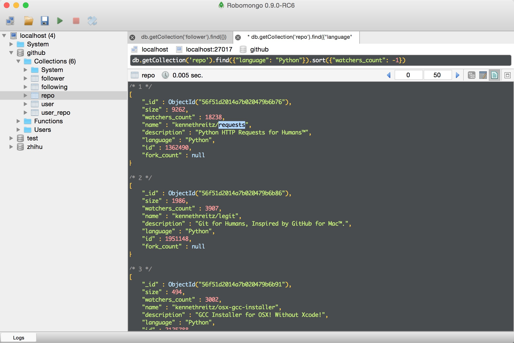
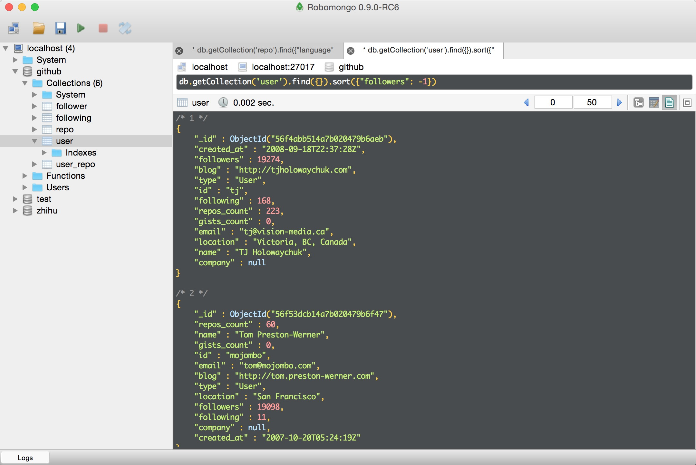
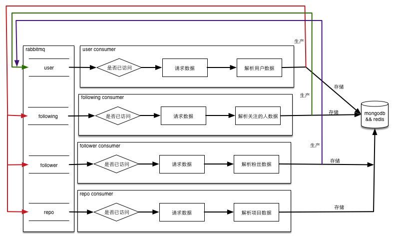
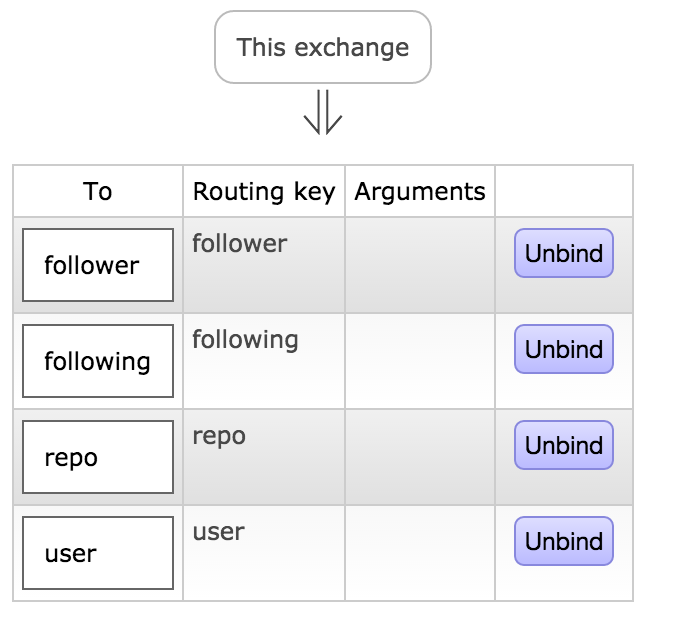
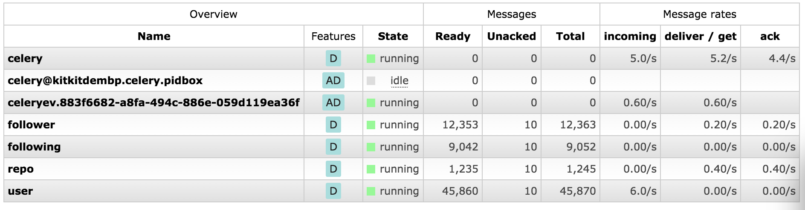

# github_spider

根据github API接口下载github用户还有他们的reposities数据，根据一个用户的following以及follower关系，遍历整个用户网，下面是流程图：


# 递归实现

## 运行命令

代码在目录recursion下。数据存储使用mongo，重复请求判断使用的redis，写mongo数据采用celery的异步调用，需要rabbitmq服务正常启动，在settings.py正确配置后，使用下面的步骤启动：

1. 进入github_spider目录
2. 执行命令```celery -A github_spider.worker worker loglevel=info```启动异步任务
3. 执行命令```python github_spider/recursion/main.py```启动爬虫

## 运行结果

因为每个请求延时很高，爬虫运行效率很慢，访问了几千个请求之后拿到了部分数据，这是按照查看数降序排列的python项目：


这是按粉丝数降序排列的用户列表


## 运行缺陷

1. 因为是深度优先，当整个用户图很大的时候，单机递归可能造成内存溢出从而使程序崩溃，只能在单机短时间运行。
2. 单个请求延时过长，数据下载速度太慢。
3. 针对一段时间内访问失败的链接没有重试机制，存在数据丢失的可能。

## 异步优化

针对这种I/O耗时的问题，解决方法也就那几种，要么多并发，要么走异步访问，要么双管齐下。针对上面的问题2，我最开始的解决方式是异步请求API。因为最开始写代码的时候考虑到了这点，代码对调用方法已经做过优化，很快就改好了，实现方式使用了[grequests](https://github.com/kennethreitz/grequests)。这个库和requests是同一个作者，代码也非常的简单，就是讲request请求用gevent做了一个简单的封装，可以非阻塞的请求数据。

但是异步处理会导致IP屏蔽，所以专门写了一个辅助脚本从网上爬取免费的HTTPS代理存放在redis中，路径proxy/extract.py，每次请求的时候都带上代理，运行错误重试自动更换代理并把错误代理清楚。但网上免费的HTTPS代理就很少，而且很多还不能用，由于大量的报错重试，访问速度没有明显提升。

# 多进程实现

## 实现原理

采取广度优先的遍历的方式，可以把要访问的网址存放在队列中，再套用生产者消费者的模式就可以很容易的实现多并发，从而解决上面的问题2。如果某段时间内一直失败，只需要将数据再仍会队列就可以彻底解决问题3。不仅如此，这种方式还可以支持中断后继续运行，程序流程图如下：




## 运行程序

为了实现多级部署，消息队列使用了rabbitmq，需要创建名为github，类型是direct的exchange，然后创建四个名称分别为user, repo, follower, following的队列，详细的绑定关系见下图：



详细的启动步骤如下：

1. 进入github_spider目录
2. 执行命令```celery -A github_spider.worker worker loglevel=info```启动异步任务
3. 执行命令```python github_spider/proxy/extract.py```更新代理
4. 执行命令```python github_spider/queue/main.py```启动脚本

队列状态图：




